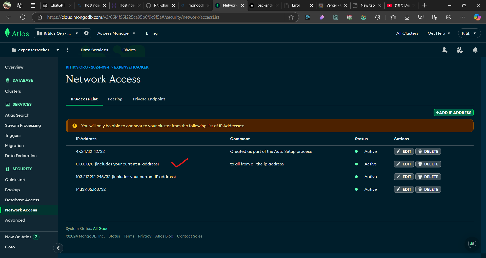
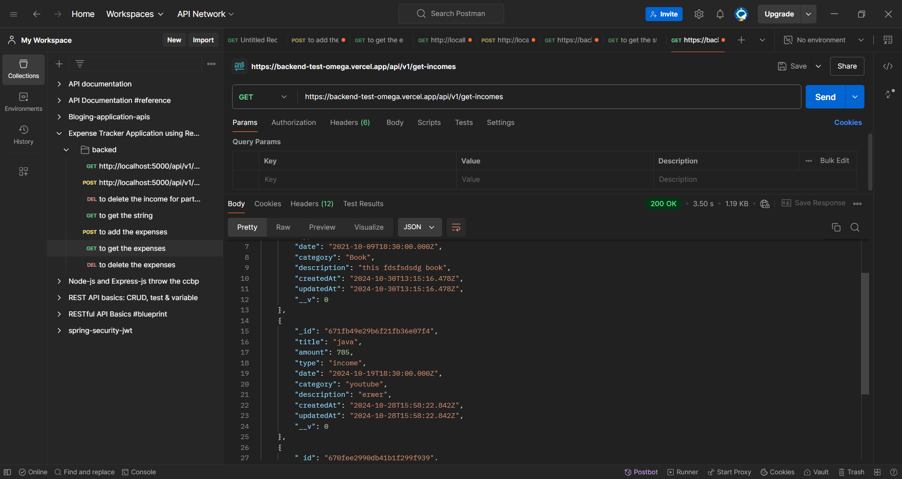

## -   when i deplay this project then at that time i got a project which is related to ip address that error happend during the deploye this project on vercel and that error show in log  ----
1) error was => 
2) db connction Error:
MongooseServerSelectionError: Could not connect to any servers in your MongoDB Atlas cluster. One common reason is that you're trying to access the database from an IP that isn't whitelisted. Make sure your current IP address is on your Atlas cluster's IP whitelist: https://www.mongodb.com/docs/atlas/security-whitelist/
    at _handleConnectionErrors (/var/task/node_modules/mongoose/lib/connection.js:900:11)
    at NativeConnection.openUri (/var/task/node_modules/mongoose/lib/connection.js:851:11)
    at runNextTicks (node:internal/process/task_queues:65:5)
    at listOnTimeout (node:internal/timers:555:9)
    at process.processTimers (node:internal/timers:529:7)
    at async db (/var/task/db/db.js:7:9) {
  reason: TopologyDescription {
    type: 'ReplicaSetNoPrimary',
    servers: Map(3) {
      'cluster0-shard-00-02.ovlax.mongodb.net:27017' => [ServerDescription],
      'cluster0-shard-00-00.ovlax.mongodb.net:27017' => [ServerDescription],
      'cluster0-shard-00-01.ovlax.mongodb.net:27017' => [ServerDescription]
    },
    stale: false,
    compatible: true,
    heartbeatFrequencyMS: 10000,
    localThresholdMS: 15,
    setName: 'atlas-1h9oqg-shard-0',
    maxElectionId: null,
    maxSetVersion: null,
    commonWireVersion: 0,
    logicalSessionTimeoutMinutes: null
  },
  code: undefined
}

3) to resove this problem 
4) The error you're encountering, MongooseServerSelectionError: Could not connect to any servers in your MongoDB Atlas cluster, typically occurs when the IP address that is trying to connect to MongoDB Atlas is not whitelisted, or there is an issue with connecting to the MongoDB servers.

Steps to Resolve the Issue:
Whitelist Your IP Address: MongoDB Atlas requires you to add your IP address to the IP whitelist to allow connections. Since you're deploying your backend on Vercel, the IP address that Vercel uses might be dynamic, so here’s what you can do:

Option 1: Add 0.0.0.0/0 to allow all IPs (for testing purposes only).

Go to your MongoDB Atlas dashboard.
Click on Network Access on the left-hand sidebar.
Under IP Whitelist, click Add IP Address.
In the input field, add 0.0.0.0/0 to allow connections from all IPs.
Click Confirm.
Note: This is not recommended for production, as it allows anyone to access your database.

Option 2: If you need more security, you can configure MongoDB to only accept connections from Vercel’s IPs. Unfortunately, Vercel does not provide static IPs for their free-tier serverless functions. However, you can configure Vercel Edge Functions, or you can directly contact Vercel support for assistance on how to get static IP addresses.
5) 
6) 
7) 